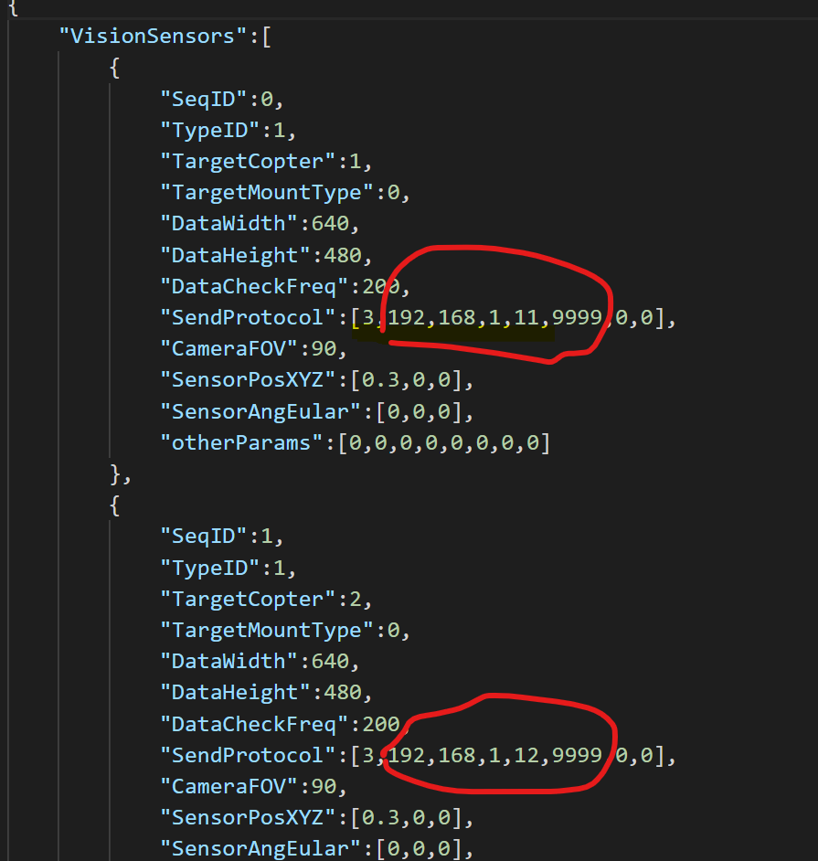
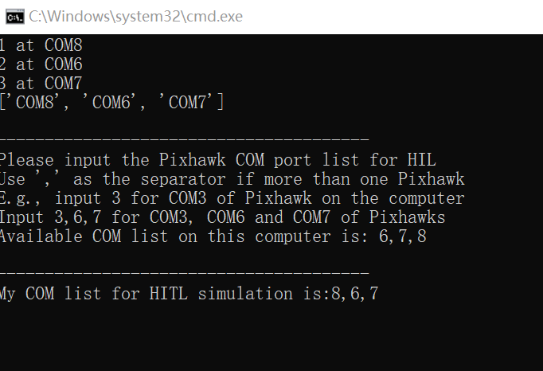
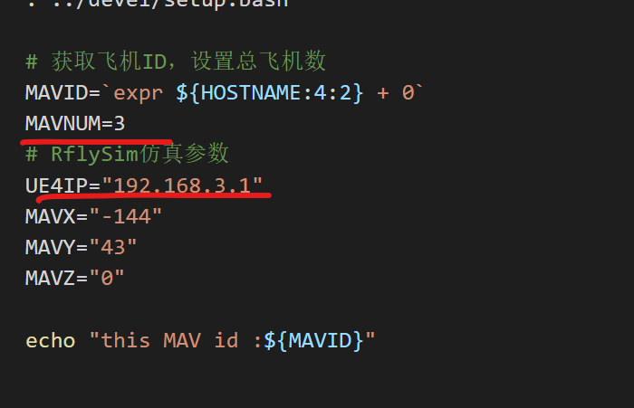
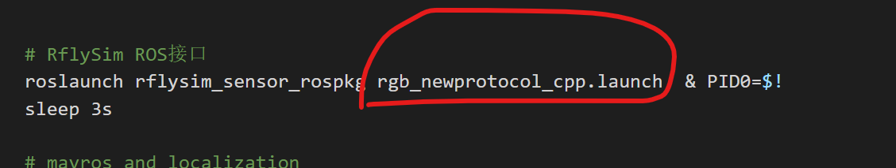
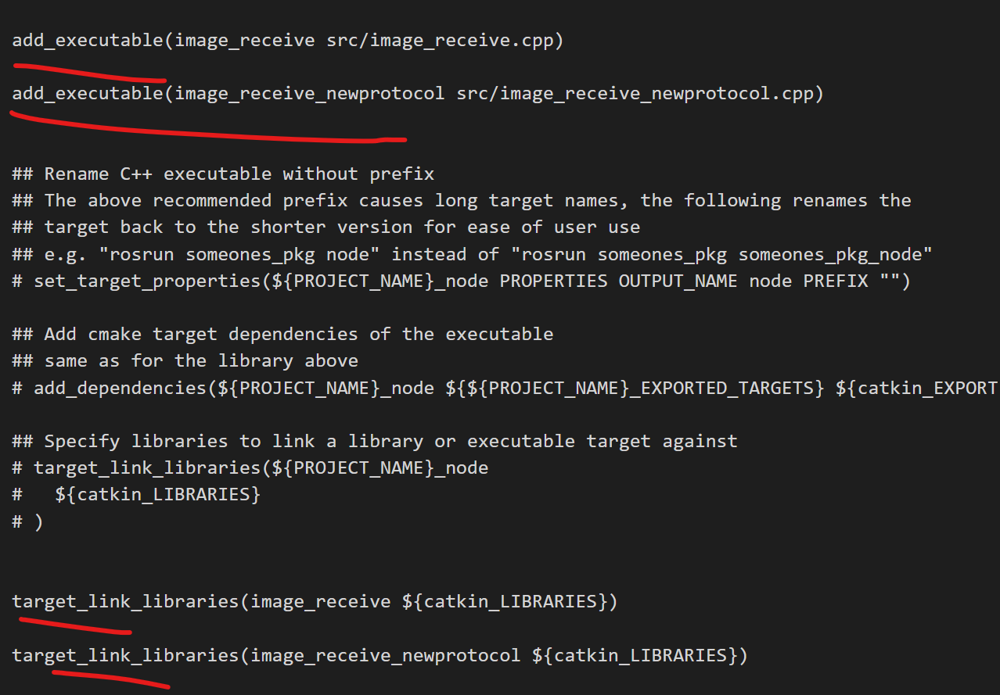

# Windows端-RflySim

**step 1**. 复制出来`32s/DistFQScenePlay_V3`文件夹，里面为Windows端所需的脚本
，`\DistFQScenePlay_V3\StartScript`下为启动脚本

**step 2**. 修改`config.json`里面图像传输的目标NX的ip地址和端口号，这里需要和NX上面接收传图的ROS节点的launch文件中相一致。



**step 3**. 双击`HITLRun.bat`启动仿真场景，启动时会输出可用串口的启动顺序，按启动顺序输入串口号，入图所示。



~~4. 双击AddModels.bat 启动添加目标人物，门，窗户，桌，椅等模型到仿真场景中。~~

# Ubuntu端-NX

**step 1**. 在NX里，新建一个工作空间。

例如bh_ws,过程这里不详细叙述，详见ros wiki。

**step 2**. 将`src.zip`复制到NX中新建的工作空间下再解压缩。

将解压后的`src`文件夹替换工作空间中的src文件夹。

**step 3**. 安装`OSQP`和`OSQP-Eigen`，`src`中`thirdparty`文件夹内已提供，因此只需编译、安装即可。参考 https://blog.csdn.net/qq_34859576/article/details/121094060

* 安装`OSQP`
```
  # cd osqp
  # mkdir build
  # cd build
  cmake -G "Unix Makefiles" ..
  cmake --build .
  cmake --build . --target install
```
* 安装`OSQP-Eigen`
```
  # cd osqp-eigen
  # mkdir build
  # cd build
  cmake -DCMAKE_INSTALL_PREFIX:PATH=/usr/local ../
  make
  sudo make install
```

**step 4**. 编译`src`内源码。
```
  catkin build swarm_msgs
  catkin build
```

**step 5**. 修改`run.sh`中的无人机数量和ue4 ip地址。



**step 6**. 在Windows端仿真启动好之后，`Gps 3D Fixed`之后，在NX端 src目录下 执行一键启动脚本
```
  bash run.sh
```


**注意**

（1）如果catkin build的时候 image_receive.cpp等cpp报错，原因是opencv版本不匹配，因此可选择在其CMakeLists.txt中注释掉cpp，同时修改src外面***run.sh***-中的***roslaunch rflysim_sensor_rospkg rgb_newprotocol_cpp.launch**为**roslaunch  rflysim_sensor_rospkg rgb_newprotocol_py.launch**。

**rflysim_sensor_rospkg同时提出C++版本和python版本的传图接口。**

（2）如果运行时image_receive.py报错，原因是代码在windows下字符被更改。因此必须注意一定要在linux下解压程序源码压缩包。




